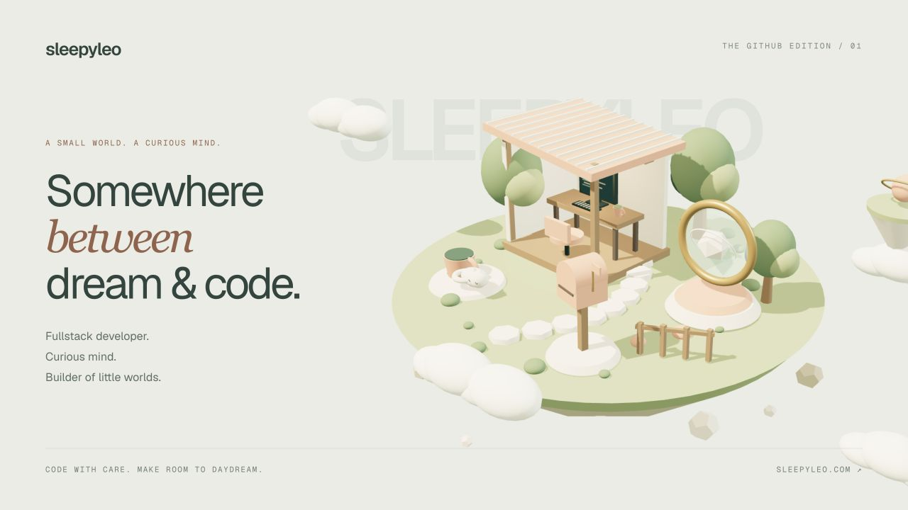
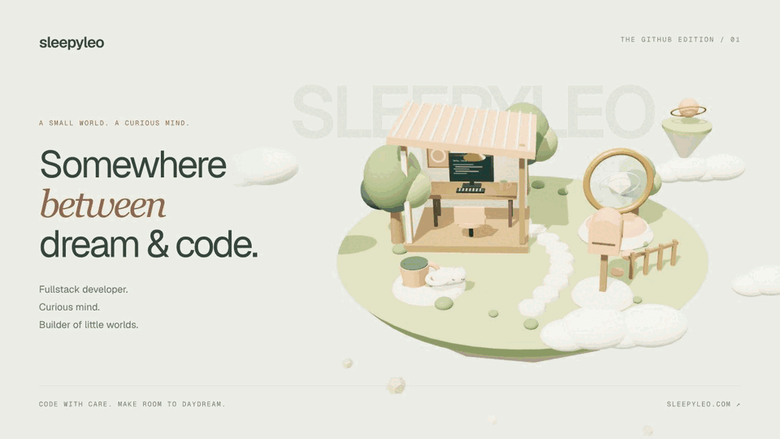
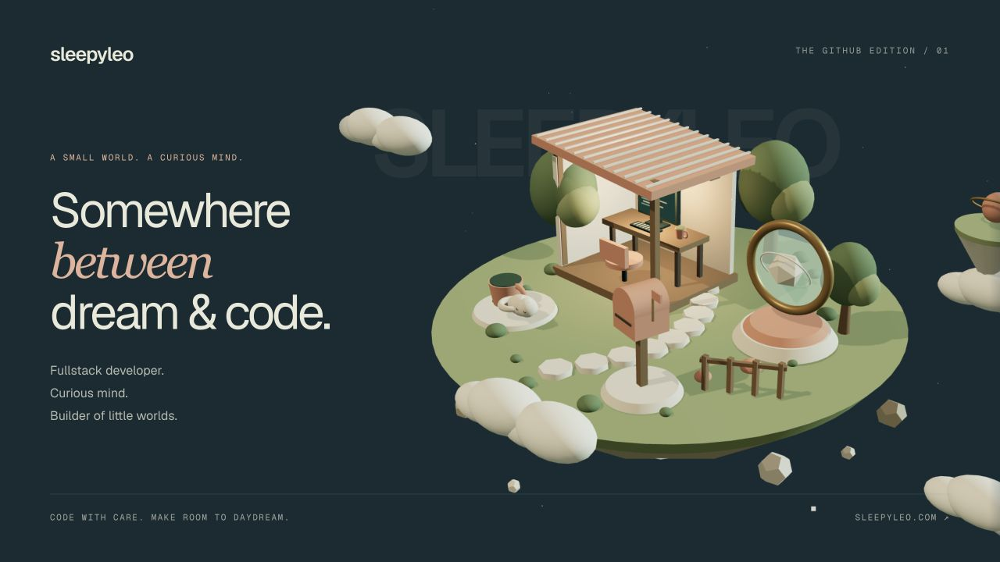

<!-- The GitHub edition of Sleepy World. All artwork is stored in this repository. -->

<a href="https://www.sleepyleo.com/">
  <picture>
    <source media="(prefers-color-scheme: dark)" srcset="assets/island-night.png">
    <source media="(prefers-color-scheme: light)" srcset="assets/island-day.png">
    
  </picture>
</a>

  <strong>Kundids Khawmeesri · SleepyLeo</strong> 
  Fullstack developer. Curious mind. Builder of little worlds.

  <a href="https://www.sleepyleo.com/"><strong>Enter the 3D island ↗</strong></a>
  &nbsp; · &nbsp;
  <a href="https://www.linkedin.com/in/kundids-khawmeesri-90814526a/">LinkedIn</a>
  &nbsp; · &nbsp;
  <a href="https://github.com/SleepyLe0?tab=repositories">All repositories</a>

<table>
  <tr>
    <td align="center" width="25%"><a href="#user-content-00--somewhere-between-dream--code"><strong>00 · THE ISLAND</strong></a> A place for possibility</td>
    <td align="center" width="25%"><a href="#user-content-01--little-sparks-real-possibilities"><strong>01 · THE WORKSHOP</strong></a> Ideas, made real</td>
    <td align="center" width="25%"><a href="#user-content-02--powered-by-curiosity-and-matcha"><strong>02 · THE SLOW CORNER</strong></a> The human behind it all</td>
    <td align="center" width="25%"><a href="#user-content-03--good-things-begin-with-a-hello"><strong>03 · THE NEXT CHAPTER</strong></a> It starts with a hello</td>
  </tr>
</table>

## 00 / Somewhere between dream & code.

I’m **SleepyLeo**. I turn curious ideas into web experiences, from the first component to the API behind it and the server that keeps it running. I care about interfaces that feel natural, code that stays understandable, and the details you notice only when they’re missing.

This is the GitHub corner of **Sleepy World**: an island with a workshop for ideas, a slow corner for matcha, and a mailbox for whatever comes next.

<strong>Take the scenic route — watch the island drift</strong>

 

The full island has orbit controls, clickable destinations, daylight and moonlight, and a reading view. [Explore it in your browser ↗](https://www.sleepyleo.com/)

## 01 / Little sparks. Real possibilities.

A few things that made it out of my head and into the world.

### [Sleepy World ↗](https://github.com/SleepyLe0/sleepyleo-website)

A personal portfolio you can wander through. A procedural Three.js island connects projects, personal notes, and contact details through camera transitions and a field-notes journal. Includes day/night lighting, reduced-motion support, and a reading fallback.

`Next.js` `React` `TypeScript` `Three.js` `Prisma` `PostgreSQL`

[Visit the island](https://www.sleepyleo.com/) · [Explore the code](https://github.com/SleepyLe0/sleepyleo-website) · [The portfolio & admin hub](https://github.com/SleepyLe0/sleepyleo)

---

### [SaByeJai ↗](https://github.com/SleepyLe0/sa-bye-jai)

A stress-management web app built around three small rituals: a Mental Box for writing down worries, a Worry Window for setting aside time, and guided breathing exercises. A React frontend meets a Rust API, with Thai and English interfaces.

`React` `TypeScript` `Rust` `Axum` `PostgreSQL` `Docker`

Inside the build

- Persistent entries and schedules backed by PostgreSQL.
- JWT authentication and a Rust/Axum backend.
- AI-assisted reframing, language support, and a responsive interface.

[Read the project notes ↗](https://github.com/SleepyLe0/sa-bye-jai#readme)

---

### [KMUTT Project Backend ↗](https://github.com/SleepyLe0/kmutt-proj-be)

A TypeScript and Express API with MongoDB persistence, validated requests, structured logging, pagination, and controller-based routing. The less-visible side of a product deserves care, too.

`TypeScript` `Express` `MongoDB` `Mongoose` `Redis`

Inside the build

- Controller, service, model, and validation layers.
- Request validation and consistent error handling.
- OpenAPI tooling, logging, and deployment configuration.

[Explore the backend ↗](https://github.com/SleepyLe0/kmutt-proj-be)

---

### [The Resilient Infrastructure Challenge ↗](https://github.com/SleepyLe0/SRE-Ansible)

An INT531 team capstone at KMUTT: deployment automation for a Next.js application and a monitoring stack on Proxmox. Bringing the application, infrastructure, and observability together.

`Ansible` `Docker` `Prometheus` `Grafana` `Proxmox`

[Deployment automation](https://github.com/SleepyLe0/SRE-Ansible) · [Monitoring notes](https://github.com/SleepyLe0/int531-sre-monitor) · [Load-testing work](https://github.com/SleepyLe0/SRE-Loadtest)

<a href="https://github.com/SleepyLe0?tab=repositories">There’s more in the workshop →</a>

## 02 / Powered by curiosity. And matcha.

Fullstack developer. TypeScript enthusiast. Professional oversleeper. I like following an idea far enough to understand how the whole thing fits together—and making the result feel a little more human.

> Build things with care. 
> Make time to daydream. 
> Don’t forget the matcha.

### Things in my toolkit

| Where I’m working | What I’m working with |
| :--- | :--- |
| **Interfaces & interaction** | TypeScript · React · Next.js · Tailwind CSS · Three.js |
| **APIs & application logic** | Node.js · Express · Rust · Axum |
| **Data & persistence** | PostgreSQL · Prisma · MongoDB · Redis |
| **Shipping & keeping it running** | Docker · GitHub Actions · Cloudflare · Ansible |
| **Seeing what’s happening** | Prometheus · Grafana · load testing |

<strong>A few things I care about</strong>

- **The first interaction.** Someone should understand where to go without a tour.
- **The quiet details.** Loading states, keyboard navigation, readable copy, and less motion when you want it.
- **The whole journey.** A polished interface matters. So does the API, the data, and a deployment that actually starts.
- **Room to play.** Sometimes the right next step is a tiny experiment, a strange little world, or a fresh cup of matcha.

<strong>Daylight or moonlight?</strong>

 

The island has two moods. The banner above follows your GitHub theme.

## 03 / Good things begin with a hello.

Have a curious idea, a new opportunity, or a story to share? There’s always room for one more conversation. No grand pitch needed.

**[Connect on LinkedIn ↗](https://www.linkedin.com/in/kundids-khawmeesri-90814526a/)** &nbsp; · &nbsp; **[Visit the mailbox ↗](https://www.sleepyleo.com/#contact)** &nbsp; · &nbsp; **[Find my work ↗](https://github.com/SleepyLe0?tab=repositories)**

---

  4 / 4 CORNERS DISCOVERED · HANDCRAFTED WITH CODE & A LITTLE DAYDREAMING 
  <a href="#user-content-00--somewhere-between-dream--code">Back to the island ↑</a>

